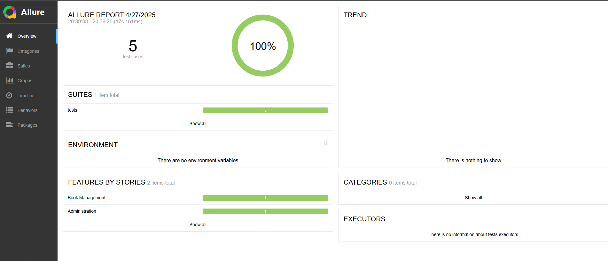
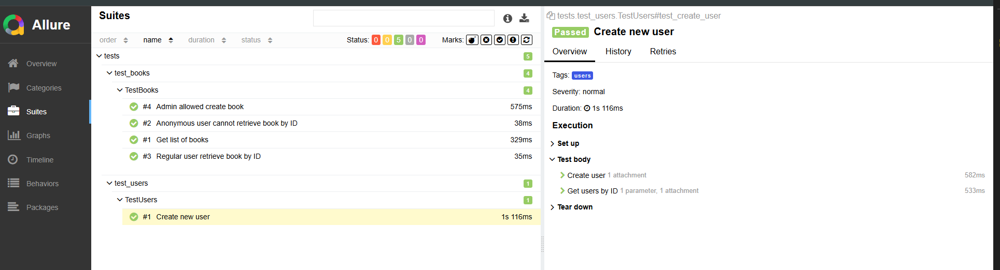

# LibraMate (Study Project)

**LibraMate** - is a REST API for managing a library model. 
The project allows you to create and view books, authors. 
The service implements full CRUD functionality for all entities and also includes sending order notifications 
via email and Telegram.
#
### Basic functionality:
+ Full CRUD for books, borrowings, users
+ Send notifications via Telegram
+ Authentication with JWT
+ Documentation via Swagger and drf-spectacular
+ Using standard Django REST Framework features (serializers, managers, view classes, etc.)
+ Automated tests and code validation by linters (flake8, isort, black)
+ Docker and Docker Compose
+ Connected services:
  + Redis
  + Celery + Celery Beat
  + Flower for monitoring Celery tasks
+ Testing with Pytest
+ Data validation with Pydantic
+ Test reporting with Allure
+ Integration with Stripe payment service

## Installation
``` python
python -m venv venv
venv\Scripts\activate 
pip install -r requirements.txt
docker-compose up --build
```
## Authentication
Authentication is implemented using JWT (SimpleJWT).

## Documentation
Swagger documentation is available at: api/schema/swagger-ui/

## Integration with Telegram
The project includes integration with the Telegram API to send real-time notifications. 
Users receive updates about book borrowings, returns, and other important events directly via Telegram messages.

## Periodic tasks
Periodic tasks are set up using Celery Beat.

## Automated Testing and Reporting with Allure



